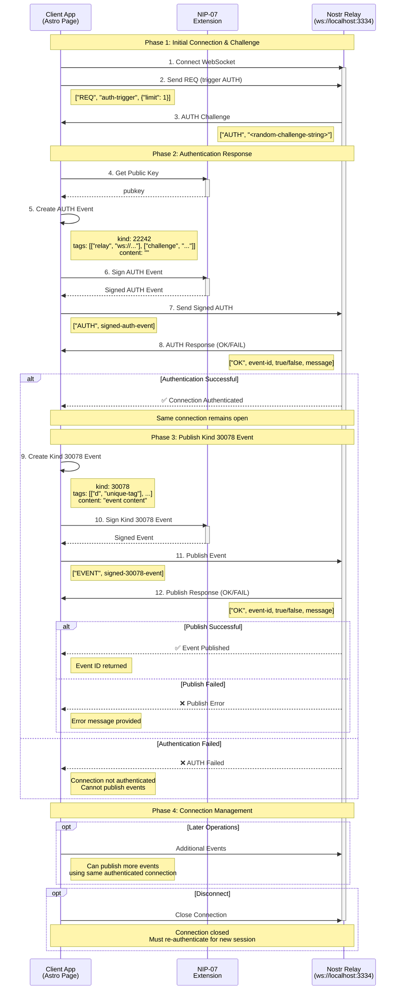

# Nostr NIP-42 AUTH with Kind 30078 Events - Astro Implementation

4 Demos in this repo - This implementation provides a modular, reusable system for NIP-42 authentication and publishing kind 30078 (Parameterized Replaceable Events) in Astro applications using nostr-tools.

## 🔗 NIP-42 Authentication Flow



# NIP-42 Authentication Message Details

## 🔄 **Message Flow Breakdown**

### **Phase 1: Connection & Challenge**

#### 1. WebSocket Connection
```javascript
// Client connects to relay
const ws = new WebSocket('ws://localhost:3334')
```

#### 2. Trigger AUTH Challenge
```json
["REQ", "auth-trigger", {"limit": 1}]
```
- **Purpose**: Many relays only send AUTH challenges when a restricted operation is attempted
- **Effect**: Prompts relay to send AUTH challenge if required

#### 3. AUTH Challenge from Relay
```json
["AUTH", "e3b0c44298fc1c149afbf4c8996fb92427ae41e4649b934ca495991b7852b855"]
```
- **Format**: `["AUTH", "<challenge-string>"]`
- **Challenge**: Random string that must be included in AUTH response
- **Security**: Prevents replay attacks

### **Phase 2: Authentication Response**

#### 4. NIP-07 Public Key Request
```javascript
const pubkey = await window.nostr.getPublicKey()
```
- **Returns**: User's public key (hex format)
- **Permission**: May trigger extension permission prompt

#### 5. Create AUTH Event (Kind 22242)
```json
{
  "kind": 22242,
  "created_at": 1699123456,
  "tags": [
    ["relay", "ws://localhost:3334"],
    ["challenge", "e3b0c44298fc1c149afbf4c8996fb92427ae41e4649b934ca495991b7852b855"]
  ],
  "content": "",
  "pubkey": "user-pubkey-hex"
}
```
- **Kind 22242**: Special event type for NIP-42 authentication
- **Required Tags**: 
  - `relay`: The relay URL being authenticated to
  - `challenge`: The exact challenge string received
- **Content**: Always empty for AUTH events

#### 6. Sign AUTH Event
```javascript
const signedAuthEvent = await window.nostr.signEvent(authEvent)
```
- **Adds**: `id` (event hash) and `sig` (signature) fields
- **Security**: Cryptographically proves ownership of private key

#### 7. Send AUTH Response
```json
["AUTH", {
  "kind": 22242,
  "created_at": 1699123456,
  "tags": [["relay", "ws://localhost:3334"], ["challenge", "..."]],
  "content": "",
  "pubkey": "...",
  "id": "event-hash",
  "sig": "signature"
}]
```

#### 8. Relay AUTH Verification
```json
["OK", "event-id", true, ""]
```
- **Format**: `["OK", event-id, success, message]`
- **Success**: `true` = authenticated, `false` = failed
- **Message**: Error description if failed

### **Phase 3: Event Publishing**

#### 9. Create Kind 30078 Event
```json
{
  "kind": 30078,
  "created_at": 1699123456,
  "tags": [
    ["d", "unique-identifier"],
    ["t", "example"],
    ["client", "astro-app"]
  ],
  "content": "Hello, authenticated Nostr!",
  "pubkey": "user-pubkey-hex"
}
```
- **Kind 30078**: Parameterized Replaceable Event
- **Required Tag**: `["d", "identifier"]` - makes event replaceable
- **Additional Tags**: Custom tags for categorization, client info, etc.

#### 10. Sign Kind 30078 Event
```javascript
const signedEvent = await window.nostr.signEvent(event)
```

#### 11. Publish Event
```json
["EVENT", {
  "kind": 30078,
  "created_at": 1699123456,
  "tags": [["d", "unique-id"], ["t", "example"]],
  "content": "Hello, authenticated Nostr!",
  "pubkey": "...",
  "id": "event-hash",
  "sig": "signature"
}]
```

#### 12. Publish Confirmation
```json
["OK", "event-id", true, ""]
```

## 🔐 **Security Features**

### **Challenge-Response Authentication**
- **Unique Challenge**: Each AUTH attempt gets a unique challenge
- **Replay Protection**: Old AUTH events cannot be reused
- **Time Sensitivity**: AUTH events typically have short validity windows

### **Cryptographic Verification**
- **Digital Signatures**: All events are cryptographically signed
- **Public Key Verification**: Relay verifies signature matches claimed pubkey
- **Event Integrity**: Event ID is hash of event content, preventing tampering

### **Connection Security**
- **Persistent Auth**: Authentication persists for the WebSocket connection lifetime
- **Per-Connection**: Each new connection requires fresh authentication
- **Selective Access**: Relays can require AUTH for specific operations only

## ⚠️ **Critical Implementation Notes**

### **Connection Persistence**
```javascript
// ✅ CORRECT: Use same connection for AUTH and publishing
const relay = await pool.ensureRelay(url)
await authenticate(relay)  // AUTH on this connection
await publishEvent(relay)  // Publish on SAME connection

// ❌ WRONG: New connection loses authentication
const relay1 = await pool.ensureRelay(url)
await authenticate(relay1)
relay1.close()

const relay2 = await pool.ensureRelay(url)  // New connection!
await publishEvent(relay2)  // Will fail - not authenticated
```

### **Challenge Handling**
```javascript
// ✅ CORRECT: Use exact challenge from relay
relay.on('auth', (challenge) => {
  const authEvent = {
    tags: [['challenge', challenge]]  // Exact challenge
  }
})

// ❌ WRONG: Modified or old challenge
const authEvent = {
  tags: [['challenge', 'old-challenge']]  // Will be rejected
}
```

### **Event Structure**
```javascript
// ✅ CORRECT: Proper kind 30078 with d-tag
const event = {
  kind: 30078,
  tags: [['d', 'unique-id']]  // Required for parameterized replaceable
}

// ❌ WRONG: Missing d-tag
const event = {
  kind: 30078,
  tags: [['t', 'topic']]  // Missing required d-tag
}
```

## 🎯 **Implementation Tips**

1. **Always handle AUTH challenges immediately**
2. **Keep the same WebSocket connection alive**
3. **Implement proper timeout handling**
4. **Validate all event structures before signing**
5. **Handle extension permission requests gracefully**
6. **Provide clear error messages to users**
7. **Test with different relay implementations**


## 🚀 Features

- **NIP-42 Authentication**: Complete relay authentication flow
- **Kind 30078 Events**: Publish parameterized replaceable events after auth
- **NIP-07 Integration**: Works with browser extension signers (Alby, nos2x, etc.)
- **Persistent Connection**: Maintains same connection for AUTH and event publishing
- **Modular Design**: Reusable across multiple Astro pages
- **Environment Configuration**: Configurable relay URLs via environment variables
- **TypeScript Support**: Full type safety and IntelliSense
- **Error Handling**: Comprehensive error handling and user feedback

## 📁 Project Structure

```
src/
├── lib/
│   └── nostr-auth.ts              # Core authentication service
├── composables/
│   └── useNostrAuth.ts            # Reusable composable with UI helpers
├── pages/
│   ├── nostr-auth-example.astro   # Complete example page
│   └── simple-nostr-example.astro # Simple usage example
└── env.d.ts                       # Environment type definitions
```

## ⚙️ Installation

1. **Install dependencies**:
```bash
npm install nostr-tools
npm install -D @types/node typescript
```

2. **Set up environment variables**:
```bash
# .env
HIVETALK_RELAYS=ws://localhost:3334
```

3. **Configure Astro** (astro.config.mjs):
```js
import { defineConfig } from 'astro/config';

export default defineConfig({
  vite: {
    define: {
      'process.env.HIVETALK_RELAYS': JSON.stringify(process.env.HIVETALK_RELAYS || 'ws://localhost:3334')
    }
  }
});
```

## 🔧 Core Components

### NostrAuthService (`src/lib/nostr-auth.ts`)

The main authentication service that handles:
- NIP-42 authentication flow
- WebSocket connection management
- Event signing and publishing
- Error handling and timeouts

**Key Methods**:
- `authenticate()`: Perform NIP-42 AUTH with relay
- `publishKind30078Event()`: Publish parameterized replaceable events
- `disconnect()`: Clean up connections
- `getAuthStatus()`: Check authentication state

### UseNostrAuth Composable (`src/composables/useNostrAuth.ts`)

A higher-level composable that provides:
- State management with reactive updates
- UI helper utilities
- Simplified API for common operations
- Event subscription system

**Key Features**:
- `subscribe()`: Listen to auth state changes
- `createUIManager()`: Automatic DOM updates
- Environment variable integration
- Error state management

## 📄 Kind 30078 Events

Kind 30078 events are Parameterized Replaceable Events that:
- Require a "d" tag as unique identifier
- Can be updated/replaced by publishing new events with same d-tag
- Support additional custom tags
- Must be published on authenticated connections (if relay requires AUTH)

**Event Structure**:
```json
{
  "kind": 30078,
  "created_at": 1699123456,
  "tags": [
    ["d", "unique-identifier"],
    ["t", "custom-tag"],
    ["client", "my-app"]
  ],
  "content": "Event content here",
  "pubkey": "...",
  "id": "...",
  "sig": "..."
}
```

## 🛠️ Configuration Options

### NostrAuthService Options
```typescript
interface AuthConfig {
  relayUrl: string    // WebSocket relay URL
  timeout?: number    // Operation timeout in ms (default: 10000)
}
```

### UseNostrAuth Options
```typescript
interface UseNostrAuthOptions {
  relayUrl?: string     // Override relay URL
  timeout?: number      // Operation timeout
  autoConnect?: boolean // Auto-authenticate when extension available
}
```

## 🔒 Security Considerations

1. **Extension Security**: Always verify NIP-07 extension availability
2. **Connection Persistence**: Maintain same connection for AUTH and publishing
3. **Event Validation**: Validate all event data before signing
4. **Error Handling**: Never expose sensitive information in error messages
5. **Timeout Management**: Use appropriate timeouts to prevent hanging

## 🐛 Troubleshooting

### Common Issues

**"NIP-07 extension not found"**
- Install a Nostr extension (Alby, nos2x, etc.)
- Refresh the page after installation

**"Authentication timeout"**
- Check relay URL and availability
- Increase timeout in configuration
- Verify relay supports NIP-42

**"Event publish failed"**
- Ensure authentication completed successfully
- Check d-tag uniqueness for replaceable events
- Verify relay accepts kind 30078 events

**"Connection lost"**
- Don't disconnect between AUTH and publishing
- Handle WebSocket connection errors gracefully
- Implement reconnection logic if needed

### Debugging Tips

1. **Enable Console Logging**: All operations log detailed information
2. **Check Network Tab**: Verify WebSocket messages in browser dev tools
3. **Test Relay**: Use a simple WebSocket client to test relay connectivity
4. **Validate Environment**: Ensure HIVETALK_RELAYS is properly set

## 📚 References

- [NIP-42: Authentication of clients to relays](https://github.com/nostr-protocol/nips/blob/master/42.md)
- [NIP-01: Basic protocol flow](https://github.com/nostr-protocol/nips/blob/master/01.md)
- [NIP-07: Browser extension interface](https://github.com/nostr-protocol/nips/blob/master/07.md)
- [Nostr Tools Documentation](https://github.com/nbd-wtf/nostr-tools)

## 🤝 Contributing

This implementation is designed to be modular and extensible. Feel free to:
- Add support for additional event kinds
- Implement reconnection logic
- Add more sophisticated error handling
- Create additional UI components

## 📄 License

This code is provided as-is for educational and development purposes. Please review and test thoroughly before using in production applications.
