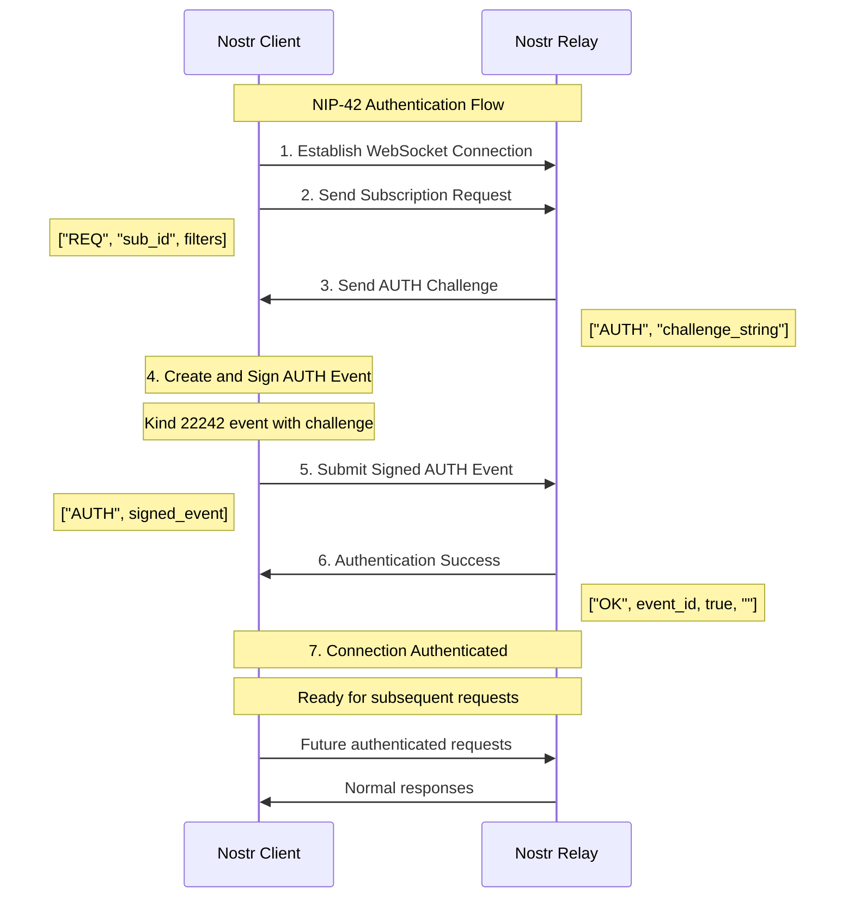

# Nostr NIP-42 AUTH with Kind 30078 Events - Astro Implementation

4 Demos in this repo - This implementation provides a modular, reusable system for NIP-42 authentication and publishing kind 30078 (Parameterized Replaceable Events) in Astro applications using nostr-tools.

## 🔗 NIP-42 Authentication Flow

1. **Connect to Relay**: Establish WebSocket connection
2. **Request Challenge**: Send subscription to trigger AUTH challenge
3. **Receive Challenge**: Relay responds with AUTH event containing challenge
4. **Sign Response**: Create and sign kind 22242 AUTH event with challenge
5. **Send AUTH**: Submit signed AUTH event to relay
6. **Confirm Success**: Wait for OK response from relay
7. **Maintain Connection**: Keep same connection for subsequent events



## 🚀 Features

- **NIP-42 Authentication**: Complete relay authentication flow
- **Kind 30078 Events**: Publish parameterized replaceable events after auth
- **NIP-07 Integration**: Works with browser extension signers (Alby, nos2x, etc.)
- **Persistent Connection**: Maintains same connection for AUTH and event publishing
- **Modular Design**: Reusable across multiple Astro pages
- **Environment Configuration**: Configurable relay URLs via environment variables
- **TypeScript Support**: Full type safety and IntelliSense
- **Error Handling**: Comprehensive error handling and user feedback

## 📁 Project Structure

```
src/
├── lib/
│   └── nostr-auth.ts              # Core authentication service
├── composables/
│   └── useNostrAuth.ts            # Reusable composable with UI helpers
├── pages/
│   ├── nostr-auth-example.astro   # Complete example page
│   └── simple-nostr-example.astro # Simple usage example
└── env.d.ts                       # Environment type definitions
```

## ⚙️ Installation

1. **Install dependencies**:
```bash
npm install nostr-tools
npm install -D @types/node typescript
```

2. **Set up environment variables**:
```bash
# .env
HIVETALK_RELAYS=ws://localhost:3334
```

3. **Configure Astro** (astro.config.mjs):
```js
import { defineConfig } from 'astro/config';

export default defineConfig({
  vite: {
    define: {
      'process.env.HIVETALK_RELAYS': JSON.stringify(process.env.HIVETALK_RELAYS || 'ws://localhost:3334')
    }
  }
});
```

## 🔧 Core Components

### NostrAuthService (`src/lib/nostr-auth.ts`)

The main authentication service that handles:
- NIP-42 authentication flow
- WebSocket connection management
- Event signing and publishing
- Error handling and timeouts

**Key Methods**:
- `authenticate()`: Perform NIP-42 AUTH with relay
- `publishKind30078Event()`: Publish parameterized replaceable events
- `disconnect()`: Clean up connections
- `getAuthStatus()`: Check authentication state

### UseNostrAuth Composable (`src/composables/useNostrAuth.ts`)

A higher-level composable that provides:
- State management with reactive updates
- UI helper utilities
- Simplified API for common operations
- Event subscription system

**Key Features**:
- `subscribe()`: Listen to auth state changes
- `createUIManager()`: Automatic DOM updates
- Environment variable integration
- Error state management

## 📄 Kind 30078 Events

Kind 30078 events are Parameterized Replaceable Events that:
- Require a "d" tag as unique identifier
- Can be updated/replaced by publishing new events with same d-tag
- Support additional custom tags
- Must be published on authenticated connections (if relay requires AUTH)

**Event Structure**:
```json
{
  "kind": 30078,
  "created_at": 1699123456,
  "tags": [
    ["d", "unique-identifier"],
    ["t", "custom-tag"],
    ["client", "my-app"]
  ],
  "content": "Event content here",
  "pubkey": "...",
  "id": "...",
  "sig": "..."
}
```

## 🛠️ Configuration Options

### NostrAuthService Options
```typescript
interface AuthConfig {
  relayUrl: string    // WebSocket relay URL
  timeout?: number    // Operation timeout in ms (default: 10000)
}
```

### UseNostrAuth Options
```typescript
interface UseNostrAuthOptions {
  relayUrl?: string     // Override relay URL
  timeout?: number      // Operation timeout
  autoConnect?: boolean // Auto-authenticate when extension available
}
```

## 🔒 Security Considerations

1. **Extension Security**: Always verify NIP-07 extension availability
2. **Connection Persistence**: Maintain same connection for AUTH and publishing
3. **Event Validation**: Validate all event data before signing
4. **Error Handling**: Never expose sensitive information in error messages
5. **Timeout Management**: Use appropriate timeouts to prevent hanging

## 🐛 Troubleshooting

### Common Issues

**"NIP-07 extension not found"**
- Install a Nostr extension (Alby, nos2x, etc.)
- Refresh the page after installation

**"Authentication timeout"**
- Check relay URL and availability
- Increase timeout in configuration
- Verify relay supports NIP-42

**"Event publish failed"**
- Ensure authentication completed successfully
- Check d-tag uniqueness for replaceable events
- Verify relay accepts kind 30078 events

**"Connection lost"**
- Don't disconnect between AUTH and publishing
- Handle WebSocket connection errors gracefully
- Implement reconnection logic if needed

### Debugging Tips

1. **Enable Console Logging**: All operations log detailed information
2. **Check Network Tab**: Verify WebSocket messages in browser dev tools
3. **Test Relay**: Use a simple WebSocket client to test relay connectivity
4. **Validate Environment**: Ensure HIVETALK_RELAYS is properly set

## 📚 References

- [NIP-42: Authentication of clients to relays](https://github.com/nostr-protocol/nips/blob/master/42.md)
- [NIP-01: Basic protocol flow](https://github.com/nostr-protocol/nips/blob/master/01.md)
- [NIP-07: Browser extension interface](https://github.com/nostr-protocol/nips/blob/master/07.md)
- [Nostr Tools Documentation](https://github.com/nbd-wtf/nostr-tools)

## 🤝 Contributing

This implementation is designed to be modular and extensible. Feel free to:
- Add support for additional event kinds
- Implement reconnection logic
- Add more sophisticated error handling
- Create additional UI components

## 📄 License

This code is provided as-is for educational and development purposes. Please review and test thoroughly before using in production applications.
